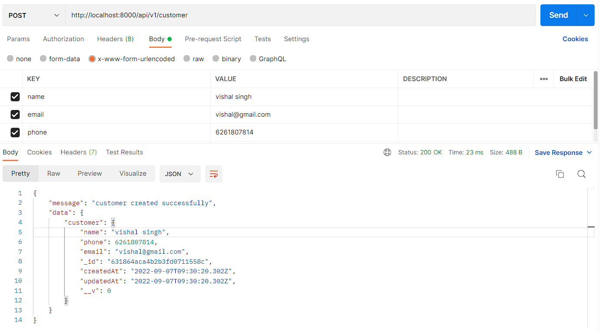
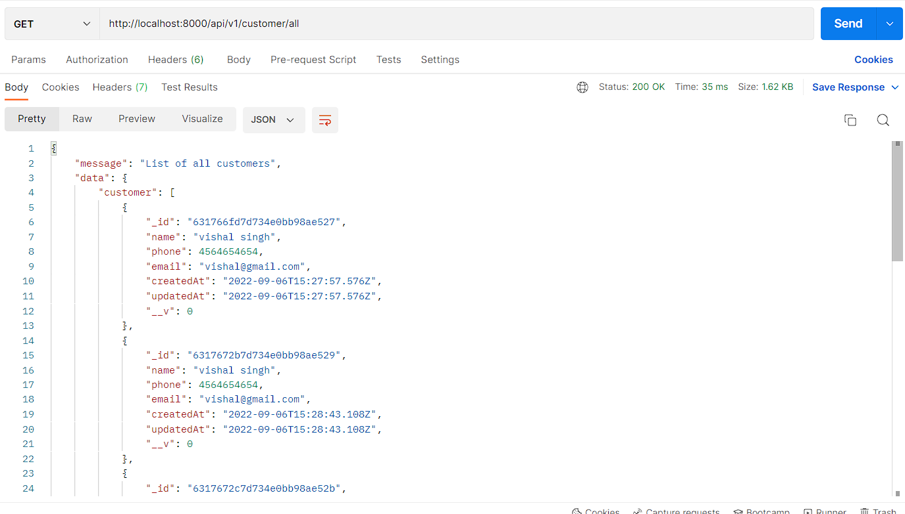
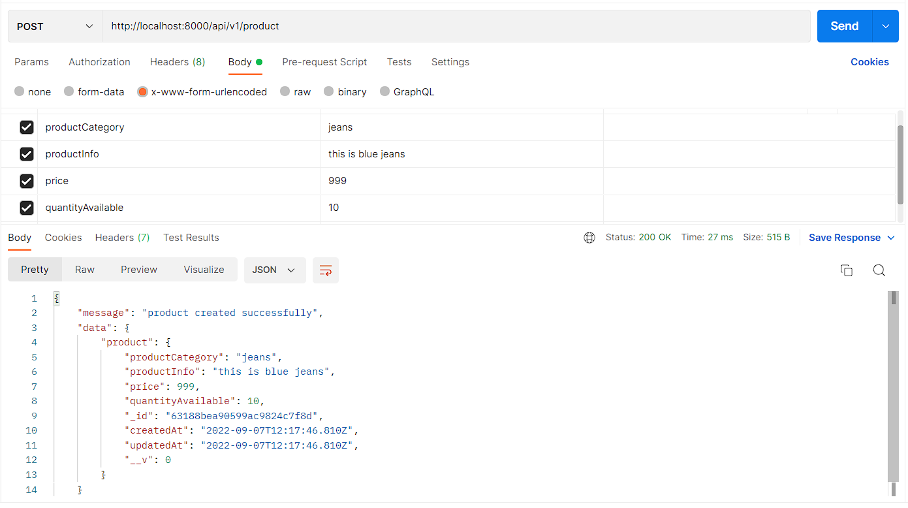
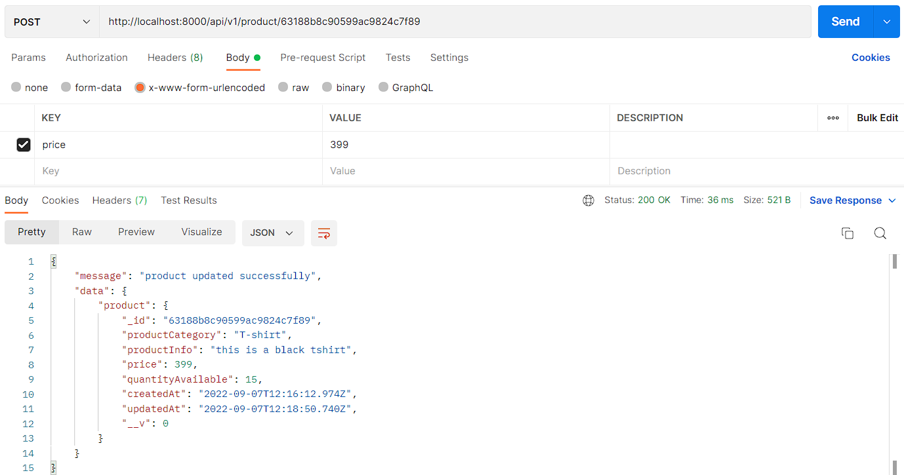
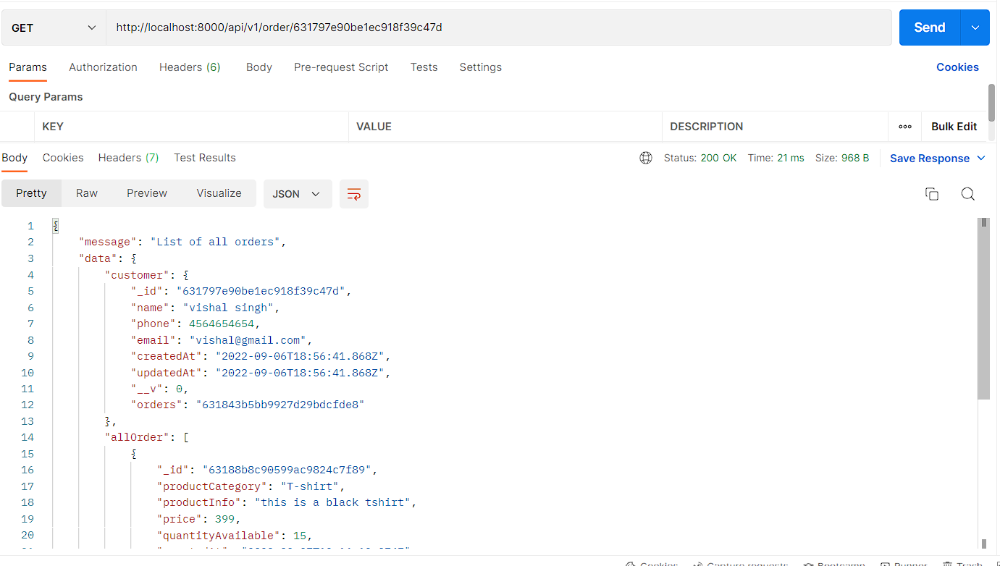

# Grocery Store Backend

`there is six API`

## 1) Api to create new Customer

    POST
    http://localhost:8000/api/v1/customer

this will create new customer

### Inside body send

```
name: vishal singh
email: vishal@gmail.com
phone: 6554684548954
```

## 2) Api to fetch all Customers list

    GET
    http://localhost:8000/api/v1/customer/all

This will fetch all the customer in data base inside customer collection

## 3) Api to create new Product

    POST
    http://localhost:8000/api/v1/product

This will create new product in data base

### Inside body send

```
productCategory: T-shirt
productInfo: some product info
price: 203
quantityAvailable: 15
```

## 4) API to update Product Price

    POST
    http://localhost:8000/api/v1/product/'id'

    InPlace of 'id' product id which you want to update.

    example:-
    http://localhost:8000/api/v1/product/63177d6103e072bb561e6e6b

### Inside body send

```
price: 999
```

## 5) Api to fetch specific Customer Orders list

    GET
    http://localhost:8000/api/v1/order/'id'

    InPlace of 'id' customer id which fetch all order by customer

    Example:-
    http://localhost:8000/api/v1/order/631797e90be1ec918f39c47d

## 6) Api to fetch customer Details with maximum Orders in an year

    GET
    http://localhost:8000/api/v1/order/data

## Folder Structure

```
Grocery-Store-Backend
├─ config
│  └─ mongoose.js
├─ controllers
│  └─ api
│     └─ v1
│        ├─ customer_api.js
│        ├─ order_api.js
│        └─ product_api.js
├─ index.js
├─ models
│  ├─ customer.js
│  ├─ orders.js
│  └─ products.js
├─ package-lock.json
├─ package.json
├─ README.md
└─ routers
   ├─ api
   │  ├─ index.js
   │  └─ v1
   │     ├─ customer.js
   │     ├─ index.js
   │     ├─ order.js
   │     └─ product.js
   └─ index.js

```

# Example how to use api

## 1) Api to create new Customer



## 2) Api to fetch all Customers list



## 3) Api to create new Product



## 4) API to update Product Price



## 5) Api to fetch specific Customer Orders list



## 6) Api to fetch customer Details with maximum Orders in an year


